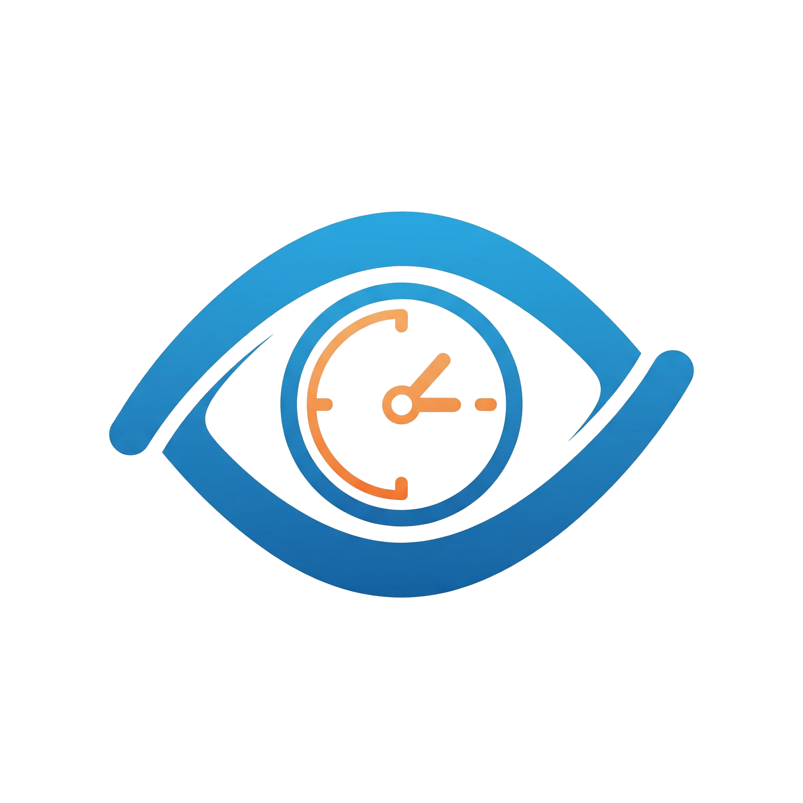

<div align="center">



# MinST — Minimize Screen Time

**Your intelligent companion for mindful digital habits**

[](https://developer.android.com)
[](https://www.java.com)
[](https://developer.android.com/topic/architecture)
[](https://developer.android.com/training/data-storage/room)
[](LICENSE)

*Reclaim your focus · Build mindful habits · Stay in control*

**[Features](#-features) · [Screenshots](#-screenshots) · [How It Works](#-how-it-works) · [Architecture](#-architecture) · [Installation](#-installation) · [Roadmap](#-roadmap)**

</div>

---

## What is MinST?

MinST (Minimize Screen Time) is a privacy-first digital wellbeing app that helps you build a healthier relationship with your phone. It goes far beyond a basic tracker — MinST uses Android's native `UsageStatsManager` API to measure **only active foreground time**, delivers intelligent break reminders when you need them most, and gives you deep behavioral insights to understand your own patterns.

All data lives entirely on your device. No accounts. No cloud sync. No ads.

---

## ✨ Features

### 🎯 Precision Usage Tracking

MinST processes raw `UsageEvents` from the Android system to calculate exact foreground time — the only time that actually matters.

- Tracks time only when an app is **actively visible** on screen
- 30-second debounce prevents inflated launch counts from quick app switches
- Handles edge cases (apps active before/after the measurement window)
- Excludes MinST itself and pure background processes
- Refreshes automatically every 5 seconds in the Usage Timeline

```java
// Core event loop in UsageStatsHelper.java
UsageEvents usageEvents = usm.queryEvents(start, end);
while (usageEvents.hasNextEvent()) {
    // Process MOVE_TO_FOREGROUND / MOVE_TO_BACKGROUND events
    // Calculate cumulative foreground duration per app
    // Handle active apps at window boundaries
}
```

---

### 🔔 Smart Break Reminder System

A state-based overlay that reminds you to take mindful breaks — without being annoying.

```
TrackingService (Active)
│
├─ Fast polling every 15s
│   ├─ Get foreground app
│   ├─ Ignored? (Home screen / MinST itself)
│   │   └─ Timer PAUSED — progress preserved
│   └─ Not ignored?
│       └─ Add elapsed time to session timer
│           └─ Timer ≥ Interval?
│               └─ Show break reminder overlay
│                   ├─ Snooze → resume after configured delay
│                   ├─ View Stats → open Usage Timeline
│                   └─ Dismiss → reset timer
│
└─ Slow polling every 5 min (background notifications)
```

**Key behaviours:**
- Timer pauses on the home screen and inside MinST — no false positives
- Snooze and interval durations are fully configurable (defaults: 1 hr / 1 min)
- Reminder state persists across service restarts and device reboots
- A "Stop Reminders" quick action sits directly in the persistent notification

---

### 📊 Per-App Analytics

Tap any app for a dedicated detail view with multi-dimensional insight cards.

| Section | What you see |
|---|---|
| **Today's Snapshot** | Foreground time, launch count, last opened |
| **Weekly Overview** | 7-day daily average, busiest day, total average (when > 7 days of data) |
| **Trend Analysis** | Day-over-day and week-over-week comparisons with colour-coded arrows |
| **Deeper Insights** | Usage rank, consecutive-day streak, average session length, weekday/weekend pattern, end-of-day forecast (after 10 AM), late-night usage (after 10 PM) |
| **Charts** | 7-day bar chart; line chart for 30+ days of historical data |

---

### 🚦 Individual App Limits

Set a custom daily time cap per app. MinST tracks progress in real time and notifies you once you hit the limit.

- Visual progress bars transition from **green → orange → red** as you approach your limit
- A warning appears in the dialog if the limit you're setting is already exceeded for today
- Notification flags reset automatically at midnight
- Removing a limit also clears the "already notified" flag, so alerts start fresh

---

### 📬 "Used More Than Yesterday" Alerts

Proactive notifications when today's usage of an app exceeds yesterday's — triggered only when the comparison is meaningful.

```java
boolean shouldNotify =
    todayUsage   > yesterdayUsage &&
    todayUsage   > TimeUnit.MINUTES.toMillis(5) &&   // must be meaningfully used today
    yesterdayUsage > TimeUnit.MINUTES.toMillis(1) && // must have been used yesterday
    !isSystemApp(packageName) &&
    !alreadyNotifiedToday.contains(packageName);     // no duplicate notifications
```

---

### 💾 Persistent Historical Data

Usage data is saved locally in a Room database and available the moment you first launch the app.

**First launch:** past 6 days are imported automatically via WorkManager (with a 2-minute delay to avoid blocking setup).  
**Every midnight:** yesterday's usage is saved by a scheduled `PeriodicWorkRequest`.

```sql
CREATE TABLE daily_usage (
    packageName TEXT NOT NULL,
    date        TEXT NOT NULL,   -- "YYYY-MM-DD"
    usageTime   INTEGER,         -- milliseconds
    PRIMARY KEY (packageName, date)
);

CREATE TABLE app_goals (
    packageName     TEXT PRIMARY KEY,
    dailyGoalMillis INTEGER,
    usageAtTimeOfSet INTEGER
);
```

---

## 📱 Screenshots

<div align="center">

<table>
<tr>
<td align="center" width="33%">

<br/><b>Main Screen</b>
<br/><sub>Central ring toggles break reminders</sub>
</td>
<td align="center" width="33%">

<br/><b>Usage Timeline</b>
<br/><sub>Live per-app breakdown, grouped by recency</sub>
</td>
<td align="center" width="33%">

<br/><b>App Insights</b>
<br/><sub>Trends, streaks, forecasts, and charts</sub>
</td>
</tr>
<tr>
<td align="center" width="50%">

<br/><b>Break Reminder Settings</b>
<br/><sub>Configure interval and snooze with presets</sub>
</td>
<td align="center" width="50%">

<br/><b>App Limits</b>
<br/><sub>Per-app daily caps with live progress</sub>
</td>
</tr>
</table>

</div>

---

## 🏗️ Architecture

MinST follows a clean, layered architecture with a single unified background service.

```
┌─────────────────────── Presentation Layer ───────────────────────┐
│  MainActivity · UsageStatsActivity · AppDetailActivity           │
│  SetGoalsActivity · SettingsActivity                             │
└──────────────────────────────┬───────────────────────────────────┘
                               │
┌──────────────────── Domain / Helper Layer ───────────────────────┐
│  AppUsageCache (Singleton, 30s TTL)                              │
│  UsageStatsHelper (Static, event-based engine)                   │
│  Prefs (Typed SharedPreferences wrapper)                         │
└──────────────────────────────┬───────────────────────────────────┘
                               │
┌───────────────────────── Data Layer ─────────────────────────────┐
│  Room Database (daily_usage, app_goals)                          │
│  SharedPreferences (service state, notification flags)           │
│  UsageStatsManager (Android system API)                          │
└──────────────────────────────┬───────────────────────────────────┘
                               │
┌───────────────────────── Service Layer ──────────────────────────┐
│  TrackingService (unified foreground service — dual-mode)        │
│  ScreenStateReceiver (screen on/off → start/stop checks)         │
│  BootCompletedReceiver (restart service after reboot)            │
│  DataSaveWorker (WorkManager — daily + initial import)           │
│  TrackingWorker (WorkManager — 15-min watchdog)                  │
└──────────────────────────────────────────────────────────────────┘
```

### Technology Stack

| Concern | Choice |
|---|---|
| Language | Java |
| Min SDK | API 24 (Android 7.0) |
| Architecture | MVVM + Clean layering |
| Background | WorkManager + Foreground Service |
| Database | Room Persistence Library |
| Charts | MPAndroidChart |
| UI | Material Design 3 + Flexbox |

### TrackingService — Dual-Mode Design

The entire background logic lives in a single foreground service that switches between two operational modes:

```java
// Fast mode (reminders ON): 15-second polling interval
// Slow mode (reminders OFF): 5-minute polling interval

private void performChecks() {
    if (areRemindersActive) updateOverlayTimer(); // overlay timer logic

    // Full notification check runs every 5 min regardless of mode
    if (System.currentTimeMillis() - lastFullCheckTimestamp > 5_MINUTES) {
        runFullNotificationChecks(); // goal limits + yesterday comparison
        lastFullCheckTimestamp = System.currentTimeMillis();
    }

    long nextDelay = areRemindersActive ? 15_000L : 300_000L;
    handler.postDelayed(checkRunnable, nextDelay);
}
```

### AppUsageCache — Performance Layer

A singleton cache with a 30-second TTL prevents redundant `UsageStatsManager` queries across rapid UI refreshes.

```java
public void getFilteredList(Context context, AppListCallback callback) {
    if (!filteredList.isEmpty() && isCacheFresh()) {
        callback.onAppListReady(new ArrayList<>(filteredList)); // instant return
        return;
    }
    refreshCache(context, callback); // background refresh → callback on main thread
}
```

---

## 🔄 How It Works

### First Launch

```
User opens app
    → Permission checklist shown (Usage Access, Overlay, Activity Recognition, Notifications)
    → All granted
        → Schedule DataSaveWorker (import past 6 days, runs after 2-min delay)
        → Schedule daily midnight DataSaveWorker
        → Schedule 15-min TrackingWorker watchdog
        → Start TrackingService
```

### Break Reminder Loop

```
User taps central ring
    → isReminderActive = true saved to SharedPreferences
    → ACTION_START_REMINDERS sent to TrackingService
    → Service switches to 15-second polling
    → Each cycle:
        - Get foreground app
        - If ignored (home / MinST) → pause timer, preserve elapsed time
        - Else → add delta to cumulativeSessionTime
        - If cumulativeSessionTime ≥ interval → show overlay
    → Overlay shown:
        - 30-second auto-dismiss countdown
        - Snooze: restarts loop after snooze delay
        - View Stats: opens UsageStatsActivity
        - Dismiss: resets timer immediately
```

### Daily Data Save

```
WorkManager fires at midnight
    → DataSaveWorker.doWork()
    → Query UsageStatsManager for yesterday's date range
    → For each app with usage > 0ms → INSERT OR REPLACE into daily_usage
    → Save "last_save_date" to SharedPreferences
```

---

## 🚀 Installation

### Requirements

- Android **7.0+** (API 24)
- ~50 MB free storage

### Download APK

1. Go to the [Releases page](https://github.com/kumarpiyushraj/MinST-Minimize-Screen-Time/releases)
2. Download the latest `MinST-vX.X.X.apk`
3. Enable **Install from Unknown Sources** and install
4. Grant all requested permissions on first launch

### Required Permissions

| Permission | Why it's needed |
|---|---|
| Usage Stats Access | Read per-app foreground time from the system |
| Display Over Other Apps | Show the break reminder overlay |
| Activity Recognition | Detect screen state for accurate polling |
| Notifications | Send goal and "more than yesterday" alerts |

### Recommended: Disable Battery Optimisation

Navigate to **Settings → Battery → Battery Optimization → MinST → Unrestricted** to ensure the background service is never killed by the OS.

### Build from Source

```bash
git clone https://github.com/kumarpiyushraj/MinST-Minimize-Screen-Time.git
cd MinST-Minimize-Screen-Time

# Build release APK
./gradlew assembleRelease

# Install directly to connected device
./gradlew installRelease
```

---

## 🔐 Privacy & Security

MinST was designed with a privacy-first philosophy from the start.

- **100% local** — all data is stored only on your device
- **No network calls** — the app requires no internet permission
- **No analytics or telemetry** — zero tracking of any kind
- **Open source** — every line of code is available for public audit

### What data MinST stores

| Data | Purpose | Where |
|---|---|---|
| App foreground time (per day) | Historical charts and trend analysis | Room Database |
| App limits | Goal tracking and notifications | Room Database |
| Service state + preferences | Restore state across restarts | SharedPreferences |

MinST never reads messages, contacts, location, or any personal files.

---

## 🗺️ Roadmap

### v1.1 — Next Release
- [ ] Focus Mode with scheduled automation (block distracting apps during work hours)
- [ ] Home screen widget for at-a-glance daily usage
- [ ] Export usage history as CSV
- [ ] Dark mode refinements

### v1.2
- [ ] Wear OS companion app
- [ ] AI-powered usage pattern insights
- [ ] Integration with calendar (auto-enable focus mode during meetings)

### v2.0 — Future Vision
- [ ] Cross-device usage sync (opt-in)
- [ ] Kotlin migration
- [ ] Browser extension companion for desktop usage tracking

---

## 🤝 Contributing

Contributions of all kinds are welcome.

```bash
# Fork the repo, then:
git clone https://github.com/YOUR_USERNAME/MinST-Minimize-Screen-Time.git
git checkout -b feature/your-feature-name

# Make your changes
git commit -m "feat: describe your change clearly"
git push origin feature/your-feature-name
# Open a Pull Request on GitHub
```

**Contribution areas:** bug fixes, new features, translations, documentation improvements, UI/UX suggestions.

**Code style:** follow standard Java conventions, keep methods focused, comment non-obvious logic, and include screenshots for any UI changes.

**Pull request checklist:**
- [ ] Builds without warnings
- [ ] Existing behaviour unchanged (or intentionally changed with explanation)
- [ ] New logic is commented
- [ ] Screenshots attached for UI changes

---

## 📄 License

```
MIT License — Copyright (c) 2024 Kumar Piyush Raj

Permission is hereby granted, free of charge, to any person obtaining a copy
of this software and associated documentation files (the "Software"), to deal
in the Software without restriction, including without limitation the rights
to use, copy, modify, merge, publish, distribute, sublicense, and/or sell
copies of the Software, and to permit persons to whom the Software is
furnished to do so, subject to the following conditions:

The above copyright notice and this permission notice shall be included in all
copies or substantial portions of the Software.

THE SOFTWARE IS PROVIDED "AS IS", WITHOUT WARRANTY OF ANY KIND, EXPRESS OR
IMPLIED, INCLUDING BUT NOT LIMITED TO THE WARRANTIES OF MERCHANTABILITY,
FITNESS FOR A PARTICULAR PURPOSE AND NONINFRINGEMENT.
```

---

## 🙏 Acknowledgements

- Android Jetpack and Material Design teams for excellent libraries
- [MPAndroidChart](https://github.com/PhilJay/MPAndroidChart) for the charting engine
- The broader Android open-source community

---

<div align="center">

**Built with care by [Kumar Piyush Raj](https://github.com/kumarpiyushraj)**

If MinST helps you reclaim even a little of your time, a ⭐ on GitHub means a lot.

[](https://github.com/kumarpiyushraj/MinST-Minimize-Screen-Time/issues)
[](https://github.com/kumarpiyushraj/MinST-Minimize-Screen-Time/discussions)
[](mailto:kmpiyushraj@gmail.com)

[↑ Back to top](#minst--minimize-screen-time)

</div>
