<!---------------------------------------------------------------------------->
<!--  HERO — Full-width waving banner                                        -->
<!---------------------------------------------------------------------------->

<div align="center">


</div>

<!---------------------------------------------------------------------------->
<!--  BADGES                                                                 -->
<!---------------------------------------------------------------------------->

<div align="center">

<br/>

[](https://developer.android.com)&nbsp;
[](https://www.java.com)&nbsp;
[](https://developer.android.com/topic/architecture)&nbsp;
[](https://developer.android.com/training/data-storage/room)&nbsp;
[](https://github.com/kumarpiyushraj/MinST-Minimize-Screen-Time)

<br/><br/>

*Reclaim your focus &nbsp;·&nbsp; Stay in control &nbsp;·&nbsp; Live mindfully*

<br/><br/>

</div>

<!---------------------------------------------------------------------------->
<!--  STATS STRIP                                                            -->
<!---------------------------------------------------------------------------->


<br/><br/>

<!---------------------------------------------------------------------------->
<!--  AT A GLANCE                                                            -->
<!---------------------------------------------------------------------------->

<div align="center">

### 📊 &nbsp;At a Glance

| 📱 Min SDK | 🏗️ Architecture | 💾 Database | ⚙️ Background | 🔒 Privacy | 🎨 UI |
|:---:|:---:|:---:|:---:|:---:|:---:|
| **Android 7.0** | **MVVM** | **Room SQLite** | **WorkManager** | **Local-only** | **Material Design 3** |

</div>

<br/><br/>

<!---------------------------------------------------------------------------->
<!--  TABLE OF CONTENTS                                                      -->
<!---------------------------------------------------------------------------->


<br/>

<div align="center">

| # | Section | # | Section |
|:---:|:---|:---:|:---|
| 01 | <a href="#about-minst">📖 About MinST</a> | 07 | <a href="#architecture">🏗️ Architecture</a> |
| 02 | <a href="#features">✨ Features</a> | 08 | <a href="#installation">🚀 Installation</a> |
| 03 | <a href="#1-accurate-real-time-usage-tracking">🎯 Accurate Usage Tracking</a> | 09 | <a href="#how-it-works">🎯 How It Works</a> |
| 04 | <a href="#2-intelligent-break-reminder-system">🔔 Break Reminder System</a> | 10 | <a href="#contributing">🤝 Contributing</a> |
| 05 | <a href="#3-comprehensive-app-analytics">📊 App Analytics</a> | 11 | <a href="#privacy-security">🔐 Privacy & Security</a> |
| 06 | <a href="#4-individual-app-limits">🎯 App Limits & Alerts</a> | 12 | <a href="#roadmap">🗺️ Roadmap</a> |

</div>

<br/><br/>

<!---------------------------------------------------------------------------->
<!--  ABOUT                                                                  -->
<!---------------------------------------------------------------------------->

<a name="about-minst"></a>


<br/>

MinST *(Minimize Screen Time)* is a sophisticated digital wellbeing application that helps you build healthier relationships with your devices. Unlike basic screen time trackers, MinST provides **precision tracking**, **intelligent break reminders**, and **actionable insights** to genuinely transform your digital habits.

<br/>

<div align="center">

| &nbsp; | Why MinST? | What It Delivers |
|:---:|:---|:---|
| 🎯 | **Precision Tracking** | Measures only active foreground time using Android's native `UsageStatsManager` API |
| 🔔 | **Smart Break Reminders** | Context-aware notifications that pause during home screen or when using MinST itself |
| 📊 | **Deep Analytics** | Comprehensive insights including usage trends, streaks, forecasts, and behavioral patterns |
| 🎨 | **Modern Design** | Beautiful Material Design 3 interface with glassmorphic effects and smooth animations |
| 🔒 | **Privacy First** | All data stored locally on your device with zero telemetry or tracking |

</div>

<br/><br/>

<!---------------------------------------------------------------------------->
<!--  FEATURES                                                               -->
<!---------------------------------------------------------------------------->

<a name="features"></a>


<br/>

<a name="1-accurate-real-time-usage-tracking"></a>

### 🎯 1. Accurate Real-Time Usage Tracking

MinST employs a custom-built event processing engine that analyzes `UsageEvents` from Android's system APIs to calculate **precise foreground time**.

<details>
<summary><b>📐 Technical Details</b></summary>

<br/>

```java
// Core tracking implementation in UsageStatsHelper.java
public static HashMap<String, ProcessedUsageStats> getProcessedUsageStats(
    Context context, long start, long end) {
    
    // Query raw usage events from the system
    UsageEvents usageEvents = usm.queryEvents(start, end);
    
    // Process MOVE_TO_FOREGROUND and MOVE_TO_BACKGROUND events
    // to calculate accurate foreground duration
    while (usageEvents.hasNextEvent()) {
        // Calculate time spent in each app
        // Handle edge cases (apps active at window boundaries)
        // Implement 30-second debounce for launch counting
    }
    
    return usageStatsMap;
}
```

<br/>

**Key Features:**
- Only counts time when apps are **actively visible on screen**
- Handles edge cases (apps active before/after measurement window)
- 30-second debounce prevents inflated launch counts
- Real-time updates every 5 seconds in Usage Timeline
- Automatically filters out system apps and MinST itself

<br/>
</details>

<br/>

---

<a name="2-intelligent-break-reminder-system"></a>

### 🔔 2. Intelligent Break Reminder System

A state-based overlay notification system that helps you take mindful breaks without being intrusive.

<div align="center">

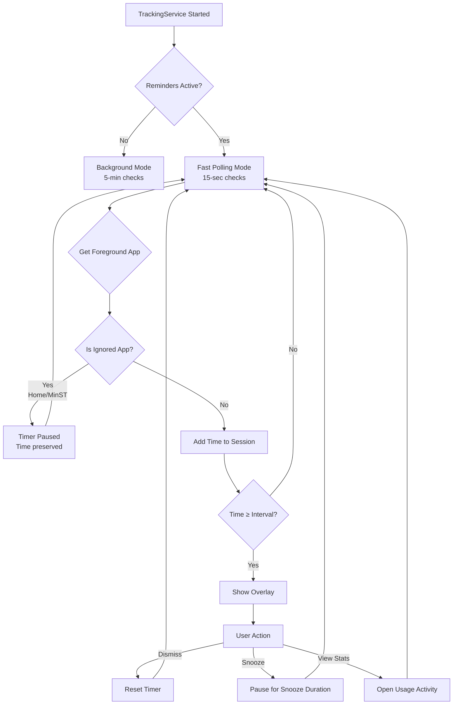
```mermaid
graph TD
    A[TrackingService Started] --> B{Reminders Active?}
    B -->|No| C[Background Mode<br/>5-min checks]
    B -->|Yes| D[Fast Polling Mode<br/>15-sec checks]
    D --> E{Get Foreground App}
    E --> F{Is Ignored App?}
    F -->|Yes<br/>Home/MinST| G[Timer Paused<br/>Time preserved]
    F -->|No| H[Add Time to Session]
    H --> I{Time ≥ Interval?}
    I -->|No| D
    I -->|Yes| J[Show Overlay]
    J --> K[User Action]
    K -->|Dismiss| L[Reset Timer]
    K -->|Snooze| M[Pause for Snooze Duration]
    K -->|View Stats| N[Open Usage Activity]
    L --> D
    M --> D
    N --> D
    G --> D
```

</div>

<div align="center">

| Step | Behaviour |
|:---:|:---|
| **1** | **Fast Polling (15s):** When reminders are active, checks current foreground app every 15 seconds |
| **2** | **Cumulative Timer:** Tracks total active usage across all non-ignored apps |
| **3** | **Smart Pausing:** Timer pauses on home screen or when using MinST, preserves progress |
| **4** | **Overlay Display:** Shows non-intrusive notification bar at configured interval (default: 1 hour) |
| **5** | **User Actions:** Snooze (1 min default), View Stats, or Dismiss |

</div>

```java
// TrackingService.java - Core timer logic
private void updateOverlayTimer() {
    String foregroundApp = UsageStatsHelper.getCurrentForegroundPackage(this);
    
    if (foregroundApp != null && !ignoredPackages.contains(foregroundApp)) {
        long delta = System.currentTimeMillis() - lastCheckTimestamp;
        cumulativeSessionTime += delta;
        
        if (cumulativeSessionTime >= Prefs.getInterval(this)) {
            showOverlay(); // Display break reminder
            cumulativeSessionTime = 0L;
        }
    }
    // Timer pauses for ignored apps
}
```

<br/>

---

<a name="3-comprehensive-app-analytics"></a>

### 📊 3. Comprehensive App Analytics

Each app gets a dedicated detail page with multi-dimensional insights.

<div align="center">

| 📊 Today's Snapshot | 📈 Weekly Overview | 📉 Trend Analysis | 🎯 Deeper Insights |
|:---|:---|:---|:---|
| Total foreground usage | 7-day daily average | Day-over-day comparison | Usage rank among all apps |
| Launch count (debounced) | Busiest day identification | Week-over-week comparison | Consecutive usage streak |
| Last used timestamp | Total average (if >7 days data) | Color-coded indicators (↑ red, ↓ green) | Average session length |
| | | | Usage pattern (weekday/weekend) |
| | | | End-of-day forecast (after 10 AM) |
| | | | Late night usage (after 10 PM) |

</div>

<br/>

**Visual Analytics:**
- **7-Day Bar Chart** — Daily usage comparison
- **30+ Day Line Chart** — Extended trend visualization
- **Dynamic Toggle** — Switch between chart views based on data availability

<br/>

---

<a name="4-individual-app-limits"></a>

### 🎯 4. Individual App Limits

Set custom daily time limits for specific apps with real-time tracking and smart notifications.

<div align="center">

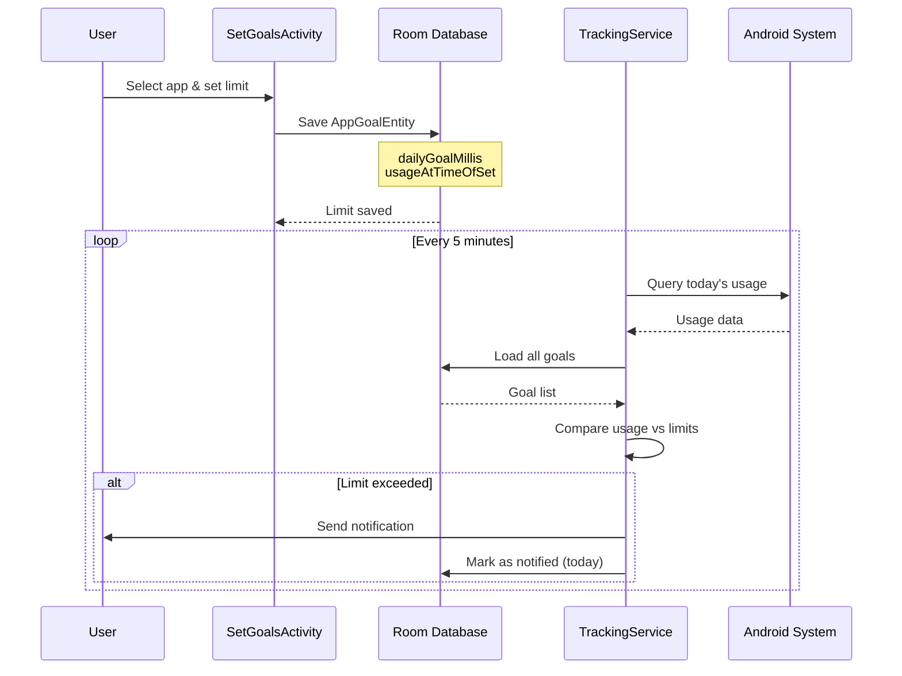
```mermaid
sequenceDiagram
    participant User
    participant UI as SetGoalsActivity
    participant DB as Room Database
    participant Service as TrackingService
    participant System as Android System

    User->>UI: Select app & set limit
    UI->>DB: Save AppGoalEntity
    Note over DB: dailyGoalMillis<br/>usageAtTimeOfSet
    DB-->>UI: Limit saved
    
    loop Every 5 minutes
        Service->>System: Query today's usage
        System-->>Service: Usage data
        Service->>DB: Load all goals
        DB-->>Service: Goal list
        Service->>Service: Compare usage vs limits
        alt Limit exceeded
            Service->>User: Send notification
            Service->>DB: Mark as notified (today)
        end
    end
```

</div>

<div align="center">

| Feature | Detail |
|:---|:---|
| 🛡️ **Smart Validation** | Warns if limit is below current usage |
| 🎨 **Visual Feedback** | Color-coded progress bars (green → orange → red) |
| 🔄 **Daily Reset** | Notification flags reset at midnight automatically |
| 📐 **Grid Layout** | 3-column display of all apps with real-time status |

</div>

<br/>

---

### 📣 5. "Used More Than Yesterday" Notifications

Proactive alerts when your usage of an app today exceeds yesterday's usage.

**Notification Criteria** — all must be true:

```java
boolean shouldNotify = 
    todayUsage > yesterdayUsage &&
    todayUsage > TimeUnit.MINUTES.toMillis(5) &&  // Meaningful today
    yesterdayUsage > TimeUnit.MINUTES.toMillis(1) && // Was used yesterday
    !isSystemApp(packageName) &&
    !alreadyNotifiedToday.contains(packageName);
```

<div align="center">

| Step | Detail |
|:---:|:---|
| **1** | **Yesterday's Cache:** Loaded once per day from Room database |
| **2** | **Live Comparison:** Today's usage fetched from `UsageStatsManager` every 5 minutes |
| **3** | **Smart Filtering:** System apps and previously notified apps excluded |
| **4** | **Notification:** Displays comparison (e.g., "Today: 2h 30m \| Yesterday: 1h 45m") |

</div>

<br/>

---

### 💾 6. Persistent Historical Data

All usage data is automatically saved to a local SQLite database for long-term analysis.

**Database Schema:**

```sql
-- Room Database (AppDatabase.java)

CREATE TABLE app_goals (
    packageName TEXT PRIMARY KEY,
    dailyGoalMillis INTEGER,
    usageAtTimeOfSet INTEGER
);

CREATE TABLE daily_usage (
    packageName TEXT,
    date TEXT,  -- Format: YYYY-MM-DD
    usageTime INTEGER,
    PRIMARY KEY (packageName, date)
);
```

**Automated Data Collection:**

<div align="center">

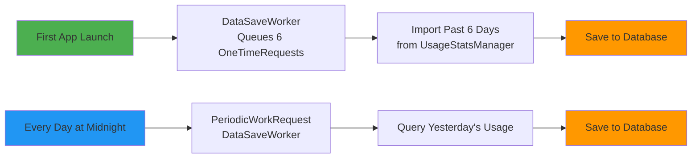
```mermaid
graph LR
    A[First App Launch] --> B[DataSaveWorker<br/>Queues 6 OneTimeRequests]
    B --> C[Import Past 6 Days<br/>from UsageStatsManager]
    C --> D[Save to Database]
    
    E[Every Day at Midnight] --> F[PeriodicWorkRequest<br/>DataSaveWorker]
    F --> G[Query Yesterday's Usage]
    G --> H[Save to Database]
    
    style A fill:#4CAF50
    style E fill:#2196F3
    style D fill:#FF9800
    style H fill:#FF9800
```

</div>

<div align="center">

| Detail | Implementation |
|:---|:---|
| 📥 **Initial Import** | Past 6 days imported on first launch (2-minute delay to avoid blocking setup) |
| 🕛 **Daily Saves** | WorkManager runs at midnight to save yesterday's data |
| ⚡ **Efficient Queries** | Room's `@MapInfo` annotation enables fast `Map<String, Long>` retrieval |
| 🔐 **Data Integrity** | REPLACE conflict strategy ensures data consistency |

</div>

<br/><br/>

<!---------------------------------------------------------------------------->
<!--  SCREENSHOTS                                                            -->
<!---------------------------------------------------------------------------->


<br/>

### Main Interface & Usage Tracking

<div align="center">

<table>
<tr>
<td align="center" width="33%">
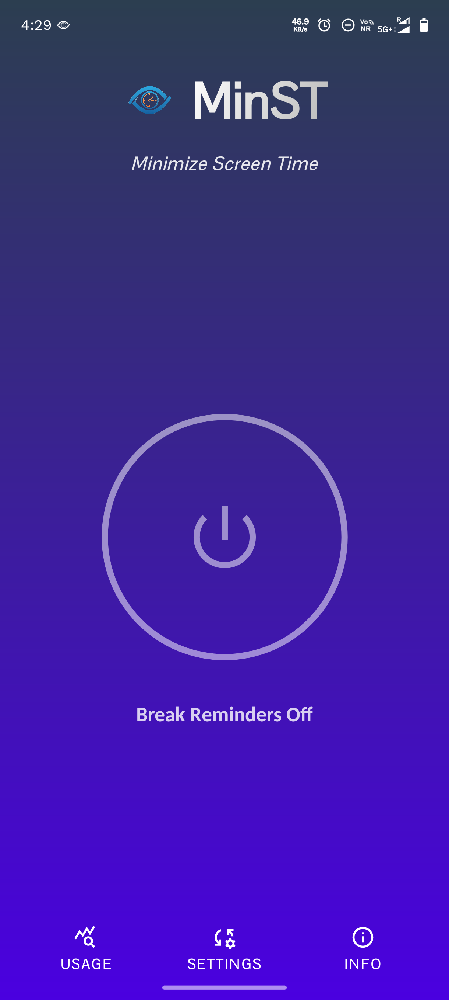
<br/><br/><b>Main Dashboard</b>
<br/><sub>Central toggle for break reminders with quick access to usage stats and settings</sub>
</td>
<td align="center" width="33%">
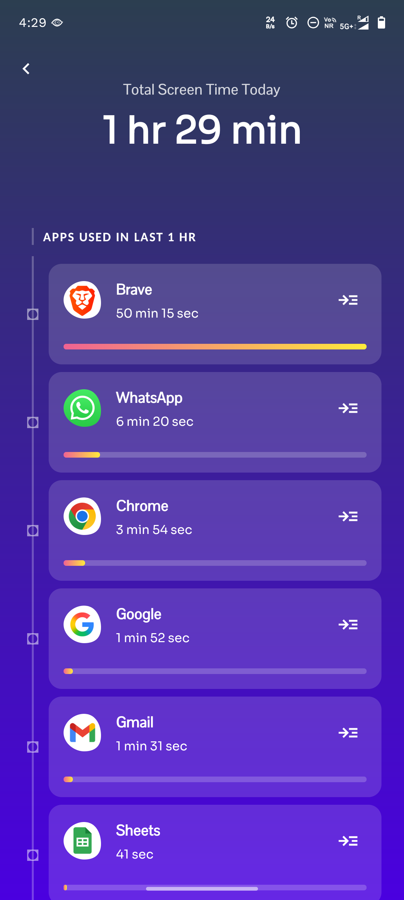
<br/><br/><b>Usage Timeline</b>
<br/><sub>Real-time screen time with per-app breakdown, categorized by recent usage</sub>
</td>
<td align="center" width="33%">
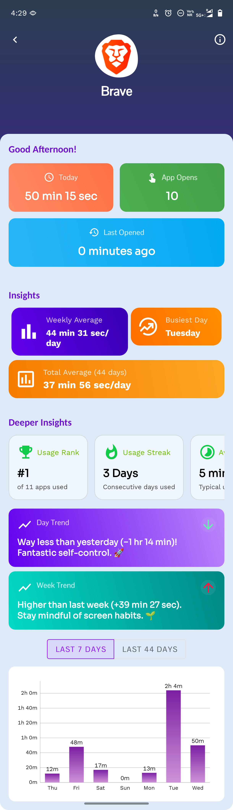
<br/><br/><b>App Insights</b>
<br/><sub>Detailed analytics with trends, streaks, forecasts, and historical charts</sub>
</td>
</tr>
</table>

</div>

<br/>

### Settings & App Limits

<div align="center">

<table>
<tr>
<td align="center" width="50%">
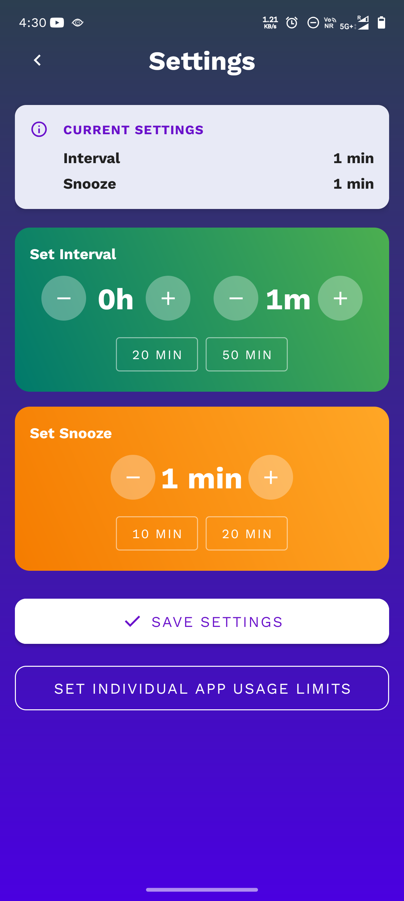
<br/><br/><b>Break Reminder Settings</b>
<br/><sub>Configure interval, snooze duration with quick preset options</sub>
</td>
<td align="center" width="50%">
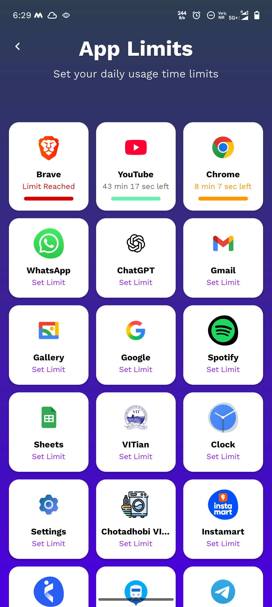
<br/><br/><b>Individual App Limits</b>
<br/><sub>Set per-app usage limits with color-coded progress indicators</sub>
</td>
</tr>
</table>

</div>

<br/><br/>

<!---------------------------------------------------------------------------->
<!--  ARCHITECTURE                                                           -->
<!---------------------------------------------------------------------------->

<a name="architecture"></a>


<br/>

MinST follows clean architecture principles with clear separation of concerns across four distinct layers.

<br/>

### 🛠️ Technology Stack

<div align="center">

| Core Technologies | | Key Libraries | |
|:---|:---|:---|:---|
| **Language** | Java | **MPAndroidChart** | Data visualization |
| **Min SDK** | 24 (Android 7.0) | **Material Components** | UI framework |
| **Architecture** | MVVM + Clean Architecture | **Flexbox Layout** | Flexible UI layouts |
| **Database** | Room Persistence Library | **AndroidX Libraries** | Jetpack components |
| **Background Tasks** | WorkManager | **RecyclerView** | Efficient list rendering |
| **Dependency Injection** | Manual (Lightweight) | | |

</div>

<br/>

### 🗂️ Architecture Diagram

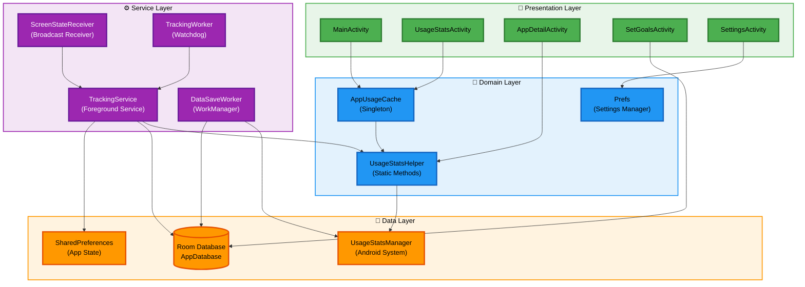
```mermaid
graph TB
    subgraph PresentationLayer["📱 Presentation Layer"]
        A1["MainActivity"]
        A2["UsageStatsActivity"]
        A3["AppDetailActivity"]
        A4["SetGoalsActivity"]
        A5["SettingsActivity"]
    end
    
    subgraph DomainLayer["🧠 Domain Layer"]
        B1["AppUsageCache<br/>(Singleton)"]
        B2["UsageStatsHelper<br/>(Static Methods)"]
        B3["Prefs<br/>(Settings Manager)"]
    end
    
    subgraph DataLayer["💾 Data Layer"]
        C1[("Room Database<br/>AppDatabase")]
        C2["SharedPreferences<br/>(App State)"]
        C3["UsageStatsManager<br/>(Android System)"]
    end
    
    subgraph ServiceLayer["⚙️ Service Layer"]
        D1["TrackingService<br/>(Foreground Service)"]
        D2["ScreenStateReceiver<br/>(Broadcast Receiver)"]
        D3["DataSaveWorker<br/>(WorkManager)"]
        D4["TrackingWorker<br/>(Watchdog)"]
    end
    
    A1 --> B1
    A2 --> B1
    A3 --> B2
    A4 --> C1
    A5 --> B3
    
    B1 --> B2
    B2 --> C3
    
    D1 --> B2
    D1 --> C1
    D1 --> C2
    D2 --> D1
    D3 --> C3
    D3 --> C1
    D4 --> D1
    
    style A1 fill:#4CAF50,stroke:#2E7D32,stroke-width:3px,color:#000
    style A2 fill:#4CAF50,stroke:#2E7D32,stroke-width:3px,color:#000
    style A3 fill:#4CAF50,stroke:#2E7D32,stroke-width:3px,color:#000
    style A4 fill:#4CAF50,stroke:#2E7D32,stroke-width:3px,color:#000
    style A5 fill:#4CAF50,stroke:#2E7D32,stroke-width:3px,color:#000
    style B1 fill:#2196F3,stroke:#1565C0,stroke-width:3px,color:#000
    style B2 fill:#2196F3,stroke:#1565C0,stroke-width:3px,color:#000
    style B3 fill:#2196F3,stroke:#1565C0,stroke-width:3px,color:#000
    style C1 fill:#FF9800,stroke:#E65100,stroke-width:3px,color:#000
    style C2 fill:#FF9800,stroke:#E65100,stroke-width:3px,color:#000
    style C3 fill:#FF9800,stroke:#E65100,stroke-width:3px,color:#000
    style D1 fill:#9C27B0,stroke:#6A1B9A,stroke-width:3px,color:#fff
    style D2 fill:#9C27B0,stroke:#6A1B9A,stroke-width:3px,color:#fff
    style D3 fill:#9C27B0,stroke:#6A1B9A,stroke-width:3px,color:#fff
    style D4 fill:#9C27B0,stroke:#6A1B9A,stroke-width:3px,color:#fff
    
    style PresentationLayer fill:#E8F5E9,stroke:#4CAF50,stroke-width:2px,color:#000
    style DomainLayer fill:#E3F2FD,stroke:#2196F3,stroke-width:2px,color:#000
    style DataLayer fill:#FFF3E0,stroke:#FF9800,stroke-width:2px,color:#000
    style ServiceLayer fill:#F3E5F5,stroke:#9C27B0,stroke-width:2px,color:#000
```

<br/>

### 🔑 Key Components

#### 1. TrackingService *(Unified Background Service)*

```java
// Dual-mode operation
public class TrackingService extends Service {
    // Background Mode (default): 5-minute checks for notifications
    private boolean areFastChecksActive = true;
    
    // Reminder Mode (user-activated): 15-second checks for overlay timer
    private boolean areRemindersActive = false;
    
    private void performChecks() {
        // Update overlay timer if reminders active
        if (areRemindersActive) updateOverlayTimer();
        
        // Run notification checks every 5 minutes
        if (shouldRunFullCheck()) runFullNotificationChecks();
        
        // Schedule next check (15s or 5min based on mode)
        long delay = areRemindersActive ? 15_000L : 300_000L;
        handler.postDelayed(checkRunnable, delay);
    }
}
```

#### 2. AppUsageCache *(Performance Optimization)*

```java
// Singleton cache with 30-second validity
public class AppUsageCache {
    private List<AppUsageModel> filteredList = new ArrayList<>();
    private long lastUpdatedTimestamp = 0;
    private static final long CACHE_VALIDITY_MS = 30_000L;
    
    public void getFilteredList(Context context, AppListCallback callback) {
        // Return cached data if fresh
        if (isCacheFresh()) {
            callback.onAppListReady(new ArrayList<>(filteredList));
            return;
        }
        
        // Otherwise refresh asynchronously
        refreshCache(context, callback);
    }
}
```

#### 3. Room Database *(Data Persistence)*

```java
@Database(entities = {AppGoalEntity.class, DailyUsageEntity.class}, 
          version = 1, exportSchema = false)
public abstract class AppDatabase extends RoomDatabase {
    public abstract GoalDao goalDao();
    public abstract UsageDao usageDao();
    
    // Thread-safe singleton instance
    private static volatile AppDatabase INSTANCE;
}
```

<br/><br/>

<!---------------------------------------------------------------------------->
<!--  INSTALLATION                                                           -->
<!---------------------------------------------------------------------------->

<a name="installation"></a>


<br/>

### Prerequisites

<div align="center">

| Requirement | Detail |
|:---|:---|
| 📱 **Android Version** | Android 7.0 (API 24) or higher |
| 💽 **Storage** | Minimum 50MB free space |

</div>

<br/>

### Download & Install

**Step 1 — Download APK**
- Visit the [Releases page](https://github.com/kumarpiyushraj/MinST-Minimize-Screen-Time/releases)
- Download the latest `MinST-vX.X.X.apk`

**Step 2 — Install**
- Enable *"Install from Unknown Sources"* in Settings
- Open the downloaded APK and follow installation prompts

**Step 3 — Grant Permissions**

<div align="center">

| Permission | Purpose | Required |
|:---|:---|:---:|
| Usage Access | Read app usage data | ✅ Yes |
| Display Over Other Apps | Show break reminders | ✅ Yes |
| Activity Recognition | Detect screen state | ✅ Yes |
| Notifications | Send usage alerts | ✅ Yes |

</div>

**Step 4 — Optimize Battery Settings** *(Recommended)*
- Navigate to: `Settings → Battery → Battery Optimization`
- Find **MinST** and select `"Don't optimize"`
- This ensures reliable alert delivery

<br/>

### Build from Source

```bash
# Clone repository
git clone https://github.com/kumarpiyushraj/MinST-Minimize-Screen-Time.git
cd MinST-Minimize-Screen-Time

# Open in Android Studio
# File > Open > Select project directory

# Build APK
./gradlew assembleRelease

# Install on connected device
./gradlew installRelease
```

<br/><br/>

<!---------------------------------------------------------------------------->
<!--  HOW IT WORKS                                                           -->
<!---------------------------------------------------------------------------->

<a name="how-it-works"></a>


<br/>

### 1. First Launch Setup

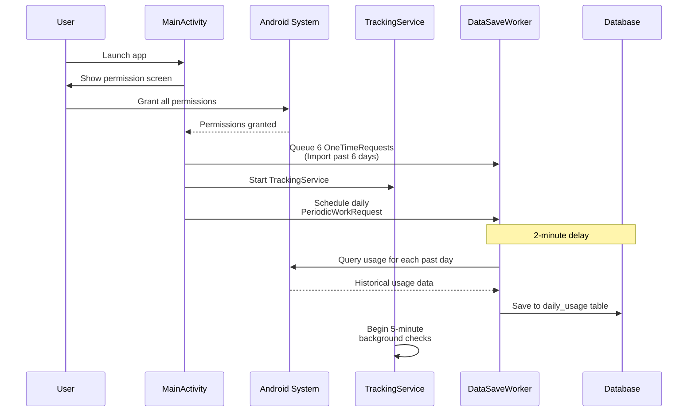
```mermaid
sequenceDiagram
    participant User
    participant MainActivity
    participant System as Android System
    participant Service as TrackingService
    participant Worker as DataSaveWorker
    participant DB as Database

    User->>MainActivity: Launch app
    MainActivity->>User: Show permission screen
    User->>System: Grant all permissions
    System-->>MainActivity: Permissions granted
    
    MainActivity->>Worker: Queue 6 OneTimeRequests<br/>(Import past 6 days)
    MainActivity->>Service: Start TrackingService
    MainActivity->>Worker: Schedule daily<br/>PeriodicWorkRequest
    
    Note over Worker,DB: 2-minute delay
    Worker->>System: Query usage for each past day
    System-->>Worker: Historical usage data
    Worker->>DB: Save to daily_usage table
    
    Service->>Service: Begin 5-minute<br/>background checks
```

<br/>

### 2. Break Reminder Flow

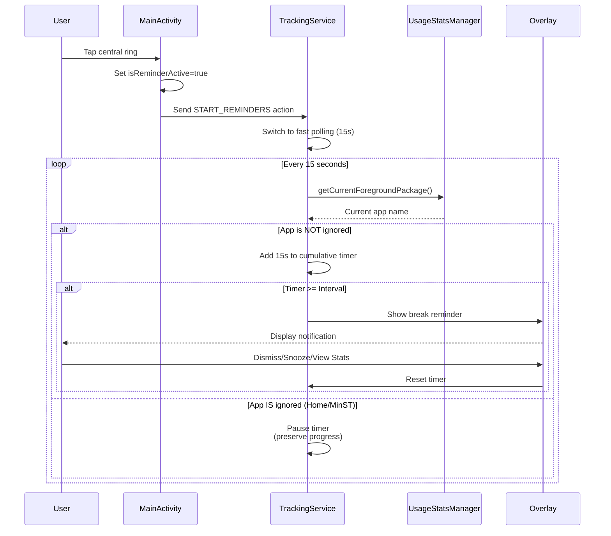
```mermaid
sequenceDiagram
    participant User
    participant MainActivity
    participant Service as TrackingService
    participant System as UsageStatsManager
    participant Overlay

    User->>MainActivity: Tap central ring
    MainActivity->>MainActivity: Set isReminderActive=true
    MainActivity->>Service: Send START_REMINDERS action
    
    Service->>Service: Switch to fast polling (15s)
    
    loop Every 15 seconds
        Service->>System: getCurrentForegroundPackage()
        System-->>Service: Current app name
        
        alt App is NOT ignored
            Service->>Service: Add 15s to cumulative timer
            
            alt Timer >= Interval
                Service->>Overlay: Show break reminder
                Overlay-->>User: Display notification
                User->>Overlay: Dismiss/Snooze/View Stats
                Overlay->>Service: Reset timer
            end
        else App IS ignored (Home/MinST)
            Service->>Service: Pause timer<br/>(preserve progress)
        end
    end
```

<br/>

### 3. Daily Usage Tracking


```mermaid
graph LR
    A["📱 UsageStatsActivity<br/>Opens"] --> B["💾 AppUsageCache<br/>Check cache"]
    B -->|"✅ Fresh"| C["⚡ Return cached data<br/>(< 30 seconds old)"]
    B -->|"🔄 Stale"| D["🔃 Background refresh"]
    
    D --> E["🔍 UsageStatsHelper<br/>Query today's events"]
    E --> F["⚙️ Process events<br/>Calculate foreground time"]
    F --> G["🎯 Filter & sort apps<br/>Exclude system apps"]
    G --> H["💾 Update cache<br/>Set timestamp"]
    H --> I["📤 Return to UI"]
    
    I --> J["📊 Display in<br/>RecyclerView"]
    J --> K["🔄 Refresh every 5s<br/>while visible"]
    
    style A fill:#4CAF50,stroke:#2E7D32,stroke-width:3px,color:#000,font-weight:bold
    style B fill:#2196F3,stroke:#1565C0,stroke-width:3px,color:#000,font-weight:bold
    style C fill:#66BB6A,stroke:#2E7D32,stroke-width:3px,color:#000,font-weight:bold
    style D fill:#42A5F5,stroke:#1565C0,stroke-width:3px,color:#000,font-weight:bold
    style E fill:#2196F3,stroke:#1565C0,stroke-width:3px,color:#000,font-weight:bold
    style F fill:#42A5F5,stroke:#1565C0,stroke-width:3px,color:#000,font-weight:bold
    style G fill:#64B5F6,stroke:#1565C0,stroke-width:3px,color:#000,font-weight:bold
    style H fill:#FF9800,stroke:#E65100,stroke-width:3px,color:#000,font-weight:bold
    style I fill:#FFB74D,stroke:#E65100,stroke-width:3px,color:#000,font-weight:bold
    style J fill:#4CAF50,stroke:#2E7D32,stroke-width:3px,color:#000,font-weight:bold
    style K fill:#66BB6A,stroke:#2E7D32,stroke-width:3px,color:#000,font-weight:bold
```

<br/><br/>

<!---------------------------------------------------------------------------->
<!--  CONTRIBUTING                                                           -->
<!---------------------------------------------------------------------------->

<a name="contributing"></a>


<br/>

Contributions are welcome! Here's how you can help make MinST even better.

<br/>

<div align="center">

| Way to Contribute | Description |
|:---:|:---|
| 🐛 **Report Bugs** | Open an issue with detailed reproduction steps |
| 💡 **Suggest Features** | Describe use cases and expected behavior |
| 🔧 **Submit Pull Requests** | Fix bugs or implement new features |
| 📖 **Improve Documentation** | Clarify instructions or add examples |
| 🌍 **Translate** | Help make MinST accessible worldwide |

</div>

<br/>

### Development Setup

```bash
# Fork and clone
git clone https://github.com/YOUR_USERNAME/MinST-Minimize-Screen-Time.git
cd MinST-Minimize-Screen-Time

# Add upstream remote
git remote add upstream https://github.com/kumarpiyushraj/MinST-Minimize-Screen-Time.git

# Create feature branch
git checkout -b feature/amazing-feature

# Make changes and commit
git commit -m "Add amazing feature"

# Push to your fork
git push origin feature/amazing-feature

# Open Pull Request on GitHub
```

<br/>

### Code Style Guidelines

- Follow [Java Code Conventions](https://www.oracle.com/java/technologies/javase/codeconventions-contents.html)
- Use meaningful variable names (avoid single letters except for loops)
- Add comments for complex logic
- Keep methods focused (single responsibility)
- Write unit tests for new features

<br/>

### Pull Request Checklist

- [ ] Code follows Java style guidelines
- [ ] All existing tests pass
- [ ] New tests added for new features
- [ ] Documentation updated (README, code comments)
- [ ] No lint warnings
- [ ] Commit messages are clear and descriptive
- [ ] Screenshots included for UI changes

<br/><br/>

<!---------------------------------------------------------------------------->
<!--  PRIVACY & SECURITY                                                     -->
<!---------------------------------------------------------------------------->

<a name="privacy-security"></a>


<br/>

MinST is designed with privacy as a core principle.

<div align="center">

| Principle | Detail |
|:---:|:---|
| 🔒 **Local-First** | All data stored on your device |
| 🚫 **Zero Tracking** | No analytics, telemetry, or user profiling |
| 🔐 **Encrypted Storage** | Sensitive data protected at rest |
| 📵 **Offline Functionality** | Full features without internet connection |
| 🔓 **Open Source** | Code available for public audit |

</div>

<br/>

### Data Collection

MinST collects **only** the following data, stored **locally** on your device:

<div align="center">

| Data Type | Purpose | Storage Location |
|:---|:---|:---|
| App usage times | Calculate screen time | Room Database |
| App launch counts | Track session frequency | Calculated on-demand |
| User preferences | Remember settings | SharedPreferences |
| Daily usage goals | Enforce limits | Room Database |

</div>

<br/>

> **MinST never:** sends data to external servers · accesses your personal files · reads your messages or calls · tracks your location · shares data with third parties

<br/><br/>

<!---------------------------------------------------------------------------->
<!--  ROADMAP                                                                -->
<!---------------------------------------------------------------------------->

<a name="roadmap"></a>


<br/>

<details>
<summary><b>📦 Version 1.1 — Next Release</b></summary>

<br/>

- [ ] Focus Mode with scheduled automation
- [ ] Dark mode improvements
- [ ] Export usage reports as CSV/PDF
- [ ] Widget for quick stats on home screen

<br/>
</details>

<details>
<summary><b>📦 Version 1.2</b></summary>

<br/>

- [ ] Wear OS companion app
- [ ] AI-powered usage insights
- [ ] Social challenges with friends
- [ ] Integration with productivity apps (Todoist, Notion)

<br/>
</details>

<details>
<summary><b>🚀 Version 2.0 — Future Vision</b></summary>

<br/>

- [ ] Cross-platform support (iOS, desktop)
- [ ] Website/browser usage tracking (requires extension)
- [ ] Mental health integration (mood tracking)
- [ ] Enterprise/education editions

<br/>
</details>

<br/><br/>

<!---------------------------------------------------------------------------->
<!--  DISCLAIMER                                                             -->
<!---------------------------------------------------------------------------->


<br/>

> MinST is a digital wellbeing tool designed to assist users in managing their screen time. It is **not a replacement** for professional help if you're struggling with technology addiction. For serious concerns, please consult a mental health professional.
>
> The app requires sensitive permissions to function properly. All data is stored locally and never transmitted without explicit consent. Review the [Privacy Policy](#-privacy--security) for complete details.

<br/><br/>

<!---------------------------------------------------------------------------->
<!--  ACKNOWLEDGMENTS                                                        -->
<!---------------------------------------------------------------------------->


<br/>

<div align="center">

| &nbsp; | Acknowledgment |
|:---:|:---|
| 🤝 | **Android Development Community** — For excellent libraries and resources |
| 🎨 | **Material Design Team** — For beautiful, accessible design guidelines |
| 💬 | **Stack Overflow Community** — For invaluable problem-solving assistance |
| 🌟 | **Open Source Contributors** — Everyone who has helped improve MinST |

</div>

<br/><br/>

<!---------------------------------------------------------------------------->
<!--  CONTACT                                                                -->
<!---------------------------------------------------------------------------->


<br/>

<div align="center">

**Need Help or Have Questions?**

<br/>

[](https://github.com/kumarpiyushraj/MinST-Minimize-Screen-Time/issues)&nbsp;
[](https://github.com/kumarpiyushraj/MinST-Minimize-Screen-Time/discussions)&nbsp;
[](mailto:kmpiyushraj@gmail.com)

</div>

<br/><br/>

<!---------------------------------------------------------------------------->
<!--  FOOTER                                                                 -->
<!---------------------------------------------------------------------------->

<div align="center">

<br/>

**Built with ❤️ for mindful living &nbsp;·&nbsp; Java &nbsp;·&nbsp; Android &nbsp;·&nbsp; Material Design 3**

<br/>

[](https://github.com/kumarpiyushraj/MinST-Minimize-Screen-Time)

<br/>

*© 2025 Kumar Piyush Raj &nbsp;·&nbsp; [GitHub @kumarpiyushraj](https://github.com/kumarpiyushraj)*


</div>
