# MinST - Minimize Screen Time

<div align="center">


**Your intelligent companion for mindful digital habits**

[](https://developer.android.com)
[](https://www.java.com)
[](https://developer.android.com/topic/architecture)
[](https://developer.android.com/training/data-storage/room)

*Reclaim your focus • Stay in control • Live mindfully*

[Features](#-features) • [How It Works](#-how-it-works) • [Screenshots](#-screenshots) • [Installation](#-installation) • [Architecture](#-architecture) • [Contributing](#-contributing)

</div>

---

## 📖 About MinST

MinST (Minimize Screen Time) is a sophisticated digital wellbeing application that helps you build healthier relationships with your devices. Unlike basic screen time trackers, MinST provides **precision tracking**, **intelligent break reminders**, and **actionable insights** to genuinely transform your digital habits.

### Why MinST?

- **🎯 Precision Tracking**: Measures only active foreground time using Android's native `UsageStatsManager` API
- **🔔 Smart Break Reminders**: Context-aware notifications that pause during home screen or when using MinST itself
- **📊 Deep Analytics**: Comprehensive insights including usage trends, streaks, forecasts, and behavioral patterns
- **🎨 Modern Design**: Beautiful Material Design 3 interface with glassmorphic effects and smooth animations
- **🔒 Privacy First**: All data stored locally on your device with zero telemetry or tracking

---

## ✨ Features

### 1. **Accurate Real-Time Usage Tracking**

MinST employs a custom-built event processing engine that analyzes `UsageEvents` from Android's system APIs to calculate **precise foreground time**.

<details>
<summary><b>📐 Technical Details</b></summary>

```java
// Core tracking implementation in UsageStatsHelper.java
public static HashMap<String, ProcessedUsageStats> getProcessedUsageStats(
    Context context, long start, long end) {
    
    // Query raw usage events from the system
    UsageEvents usageEvents = usm.queryEvents(start, end);
    
    // Process MOVE_TO_FOREGROUND and MOVE_TO_BACKGROUND events
    // to calculate accurate foreground duration
    while (usageEvents.hasNextEvent()) {
        // Calculate time spent in each app
        // Handle edge cases (apps active at window boundaries)
        // Implement 30-second debounce for launch counting
    }
    
    return usageStatsMap;
}
```

**Key Features:**
- Only counts time when apps are **actively visible on screen**
- Handles edge cases (apps active before/after measurement window)
- 30-second debounce prevents inflated launch counts
- Real-time updates every 5 seconds in Usage Timeline
- Automatically filters out system apps and MinST itself

</details>

---

### 2. **Intelligent Break Reminder System**

A state-based overlay notification system that helps you take mindful breaks without being intrusive.

```mermaid
graph TD
    A[TrackingService Started] --> B{Reminders Active?}
    B -->|No| C[Background Mode<br/>5-min checks]
    B -->|Yes| D[Fast Polling Mode<br/>15-sec checks]
    D --> E{Get Foreground App}
    E --> F{Is Ignored App?}
    F -->|Yes<br/>Home/MinST| G[Timer Paused<br/>Time preserved]
    F -->|No| H[Add Time to Session]
    H --> I{Time ≥ Interval?}
    I -->|No| D
    I -->|Yes| J[Show Overlay]
    J --> K[User Action]
    K -->|Dismiss| L[Reset Timer]
    K -->|Snooze| M[Pause for Snooze Duration]
    K -->|View Stats| N[Open Usage Activity]
    L --> D
    M --> D
    N --> D
    G --> D
```

<div align="center">



</div>

**How It Works:**
1. **Fast Polling (15s)**: When reminders are active, checks current foreground app every 15 seconds
2. **Cumulative Timer**: Tracks total active usage across all non-ignored apps
3. **Smart Pausing**: Timer pauses on home screen or when using MinST, preserves progress
4. **Overlay Display**: Shows non-intrusive notification bar at configured interval (default: 1 hour)
5. **User Actions**: Snooze (1 min default), View Stats, or Dismiss

**Code Reference:**
```java
// TrackingService.java - Core timer logic
private void updateOverlayTimer() {
    String foregroundApp = UsageStatsHelper.getCurrentForegroundPackage(this);
    
    if (foregroundApp != null && !ignoredPackages.contains(foregroundApp)) {
        long delta = System.currentTimeMillis() - lastCheckTimestamp;
        cumulativeSessionTime += delta;
        
        if (cumulativeSessionTime >= Prefs.getInterval(this)) {
            showOverlay(); // Display break reminder
            cumulativeSessionTime = 0L;
        }
    }
    // Timer pauses for ignored apps
}
```

---

### 3. **Comprehensive App Analytics**

Each app gets a dedicated detail page with multi-dimensional insights.

<table>
<tr>
<td width="50%">

**📊 Today's Snapshot**
- Total foreground usage
- Launch count (debounced)
- Last used timestamp

**📈 Weekly Overview**
- 7-day daily average
- Busiest day identification
- Total average (if >7 days data)

</td>
<td width="50%">

**📉 Trend Analysis**
- Day-over-day comparison
- Week-over-week comparison
- Color-coded indicators (↑ red, ↓ green)

**🎯 Deeper Insights**
- Usage rank among all apps
- Consecutive usage streak
- Average session length
- Usage pattern (weekday/weekend)
- End-of-day forecast (after 10 AM)
- Late night usage (after 10 PM)

</td>
</tr>
</table>

**Visual Analytics:**
- **7-Day Bar Chart**: Daily usage comparison
- **30+ Day Line Chart**: Extended trend visualization
- **Dynamic Toggle**: Switch between chart views based on data availability

---

### 4. **Individual App Limits**

Set custom daily time limits for specific apps with real-time tracking and smart notifications.

**Implementation Flow:**


**Features:**
- **Smart Validation**: Warns if limit is below current usage
- **Visual Feedback**: Color-coded progress bars (green → orange → red)
- **Daily Reset**: Notification flags reset at midnight automatically
- **Grid Layout**: 3-column display of all apps with real-time status

---

### 5. **"Used More Than Yesterday" Notifications**

Proactive alerts when your usage of an app today exceeds yesterday's usage.

**Notification Criteria** (all must be true):
```java
boolean shouldNotify = 
    todayUsage > yesterdayUsage &&
    todayUsage > TimeUnit.MINUTES.toMillis(5) &&  // Meaningful today
    yesterdayUsage > TimeUnit.MINUTES.toMillis(1) && // Was used yesterday
    !isSystemApp(packageName) &&
    !alreadyNotifiedToday.contains(packageName);
```

**Data Flow:**
1. **Yesterday's Cache**: Loaded once per day from Room database
2. **Live Comparison**: Today's usage fetched from `UsageStatsManager` every 5 minutes
3. **Smart Filtering**: System apps and previously notified apps excluded
4. **Notification**: Displays comparison (e.g., "Today: 2h 30m | Yesterday: 1h 45m")

---

### 6. **Persistent Historical Data**

All usage data is automatically saved to a local SQLite database for long-term analysis.

**Database Schema:**

```sql
-- Room Database (AppDatabase.java)

CREATE TABLE app_goals (
    packageName TEXT PRIMARY KEY,
    dailyGoalMillis INTEGER,
    usageAtTimeOfSet INTEGER
);

CREATE TABLE daily_usage (
    packageName TEXT,
    date TEXT,  -- Format: YYYY-MM-DD
    usageTime INTEGER,
    PRIMARY KEY (packageName, date)
);
```

**Automated Data Collection:**

<div align="center">


</div>

**Implementation Highlights:**
- **Initial Import**: Past 6 days imported on first launch (2-minute delay to avoid blocking setup)
- **Daily Saves**: WorkManager runs at midnight to save yesterday's data
- **Efficient Queries**: Room's `@MapInfo` annotation enables fast Map<String, Long> retrieval
- **Data Integrity**: REPLACE conflict strategy ensures data consistency

---

## 📱 Screenshots

<div align="center">

### Main Interface & Usage Tracking

<table>
<tr>
<td align="center" width="33%">

<br/><b>Main Dashboard</b>
<br/>Central toggle for break reminders with quick access to usage stats and settings
</td>
<td align="center" width="33%">

<br/><b>Usage Timeline</b>
<br/>Real-time screen time with per-app breakdown, categorized by recent usage
</td>
<td align="center" width="33%">

<br/><b>App Insights</b>
<br/>Detailed analytics with trends, streaks, forecasts, and historical charts
</td>
</tr>
</table>

### Settings & App Limits

<table>
<tr>
<td align="center" width="50%">

<br/><b>Break Reminder Settings</b>
<br/>Configure interval, snooze duration with quick preset options
</td>
<td align="center" width="50%">

<br/><b>Individual App Limits</b>
<br/>Set per-app usage limits with color-coded progress indicators
</td>
</tr>
</table>

</div>

---

## 🏗️ Architecture

MinST follows clean architecture principles with clear separation of concerns.

### **Technology Stack**

<table>
<tr>
<td width="50%">

**Core Technologies**
- **Language**: Java
- **Min SDK**: 24 (Android 7.0)
- **Architecture**: MVVM + Clean Architecture
- **Database**: Room Persistence Library
- **Background Tasks**: WorkManager
- **Dependency Injection**: Manual (Lightweight)

</td>
<td width="50%">

**Key Libraries**
- **MPAndroidChart**: Data visualization
- **Material Components**: UI framework
- **Flexbox Layout**: Flexible UI layouts
- **AndroidX Libraries**: Jetpack components
- **RecyclerView**: Efficient list rendering

</td>
</tr>
</table>

### **Architecture Diagram**


### **Key Components**

#### **1. TrackingService** (Unified Background Service)
```java
// Dual-mode operation
public class TrackingService extends Service {
    // Background Mode (default): 5-minute checks for notifications
    private boolean areFastChecksActive = true;
    
    // Reminder Mode (user-activated): 15-second checks for overlay timer
    private boolean areRemindersActive = false;
    
    private void performChecks() {
        // Update overlay timer if reminders active
        if (areRemindersActive) updateOverlayTimer();
        
        // Run notification checks every 5 minutes
        if (shouldRunFullCheck()) runFullNotificationChecks();
        
        // Schedule next check (15s or 5min based on mode)
        long delay = areRemindersActive ? 15_000L : 300_000L;
        handler.postDelayed(checkRunnable, delay);
    }
}
```

#### **2. AppUsageCache** (Performance Optimization)
```java
// Singleton cache with 30-second validity
public class AppUsageCache {
    private List<AppUsageModel> filteredList = new ArrayList<>();
    private long lastUpdatedTimestamp = 0;
    private static final long CACHE_VALIDITY_MS = 30_000L;
    
    public void getFilteredList(Context context, AppListCallback callback) {
        // Return cached data if fresh
        if (isCacheFresh()) {
            callback.onAppListReady(new ArrayList<>(filteredList));
            return;
        }
        
        // Otherwise refresh asynchronously
        refreshCache(context, callback);
    }
}
```

#### **3. Room Database** (Data Persistence)
```java
@Database(entities = {AppGoalEntity.class, DailyUsageEntity.class}, 
          version = 1, exportSchema = false)
public abstract class AppDatabase extends RoomDatabase {
    public abstract GoalDao goalDao();
    public abstract UsageDao usageDao();
    
    // Thread-safe singleton instance
    private static volatile AppDatabase INSTANCE;
}
```

---

## 🚀 Installation

### **Prerequisites**
- Android device running **Android 7.0 (API 24)** or higher
- Minimum **50MB** free storage space

### **Download & Install**

1. **Download APK**
   - Visit the [Releases page](https://github.com/kumarpiyushraj/MinST-Minimize-Screen-Time/releases)
   - Download the latest `MinST-vX.X.X.apk`

2. **Install**
   - Enable "Install from Unknown Sources" in Settings
   - Open the downloaded APK and follow installation prompts

3. **Grant Permissions**
   
   MinST requires the following permissions for core functionality:

   | Permission | Purpose | Required |
   |------------|---------|----------|
   | Usage Access | Read app usage data | ✅ Yes |
   | Display Over Other Apps | Show break reminders | ✅ Yes |
   | Activity Recognition | Detect screen state | ✅ Yes |
   | Notifications | Send usage alerts | ✅ Yes |

4. **Optimize Battery Settings** (Recommended)
   - Navigate to: `Settings → Battery → Battery Optimization`
   - Find **MinST** and select **"Don't optimize"**
   - This ensures reliable alert delivery

### **Build from Source**

```bash
# Clone repository
git clone https://github.com/kumarpiyushraj/MinST-Minimize-Screen-Time.git
cd MinST-Minimize-Screen-Time

# Open in Android Studio
# File > Open > Select project directory

# Build APK
./gradlew assembleRelease

# Install on connected device
./gradlew installRelease
```

---

## 🎯 How It Works

### **1. First Launch Setup**


### **2. Break Reminder Flow**


### **3. Daily Usage Tracking**


---

## 🤝 Contributing

Contributions are welcome! Here's how you can help make MinST even better.

### **Ways to Contribute**

- 🐛 **Report Bugs**: Open an issue with detailed reproduction steps
- 💡 **Suggest Features**: Describe use cases and expected behavior
- 🔧 **Submit Pull Requests**: Fix bugs or implement new features
- 📖 **Improve Documentation**: Clarify instructions or add examples
- 🌍 **Translate**: Help make MinST accessible worldwide

### **Development Setup**

```bash
# Fork and clone
git clone https://github.com/YOUR_USERNAME/MinST-Minimize-Screen-Time.git
cd MinST-Minimize-Screen-Time

# Add upstream remote
git remote add upstream https://github.com/kumarpiyushraj/MinST-Minimize-Screen-Time.git

# Create feature branch
git checkout -b feature/amazing-feature

# Make changes and commit
git commit -m "Add amazing feature"

# Push to your fork
git push origin feature/amazing-feature

# Open Pull Request on GitHub
```

### **Code Style Guidelines**

- Follow [Java Code Conventions](https://www.oracle.com/java/technologies/javase/codeconventions-contents.html)
- Use meaningful variable names (avoid single letters except for loops)
- Add comments for complex logic
- Keep methods focused (single responsibility)
- Write unit tests for new features

### **Pull Request Checklist**

- [ ] Code follows Java style guidelines
- [ ] All existing tests pass
- [ ] New tests added for new features
- [ ] Documentation updated (README, code comments)
- [ ] No lint warnings
- [ ] Commit messages are clear and descriptive
- [ ] Screenshots included for UI changes

---

## 🔐 Privacy & Security

MinST is designed with privacy as a core principle.

- **🔒 Local-First**: All data stored on your device
- **🚫 Zero Tracking**: No analytics, telemetry, or user profiling
- **🔐 Encrypted Storage**: Sensitive data protected at rest
- **📵 Offline Functionality**: Full features without internet connection
- **🔓 Open Source**: Code available for public audit

### **Data Collection**

MinST collects **only** the following data, stored **locally** on your device:

| Data Type | Purpose | Storage Location |
|-----------|---------|------------------|
| App usage times | Calculate screen time | Room Database |
| App launch counts | Track session frequency | Calculated on-demand |
| User preferences | Remember settings | SharedPreferences |
| Daily usage goals | Enforce limits | Room Database |

**MinST never:**
- Sends data to external servers
- Accesses your personal files
- Reads your messages or calls
- Tracks your location
- Shares data with third parties

---

## 📄 License

```
MIT License

Copyright (c) 2024 Kumar Piyush Raj

Permission is hereby granted, free of charge, to any person obtaining a copy
of this software and associated documentation files (the "Software"), to deal
in the Software without restriction, including without limitation the rights
to use, copy, modify, merge, publish, distribute, sublicense, and/or sell
copies of the Software, and to permit persons to whom the Software is
furnished to do so, subject to the following conditions:

The above copyright notice and this permission notice shall be included in all
copies or substantial portions of the Software.

THE SOFTWARE IS PROVIDED "AS IS", WITHOUT WARRANTY OF ANY KIND, EXPRESS OR
IMPLIED, INCLUDING BUT NOT LIMITED TO THE WARRANTIES OF MERCHANTABILITY,
FITNESS FOR A PARTICULAR PURPOSE AND NONINFRINGEMENT. IN NO EVENT SHALL THE
AUTHORS OR COPYRIGHT HOLDERS BE LIABLE FOR ANY CLAIM, DAMAGES OR OTHER
LIABILITY, WHETHER IN AN ACTION OF CONTRACT, TORT OR OTHERWISE, ARISING FROM,
OUT OF OR IN CONNECTION WITH THE SOFTWARE OR THE USE OR OTHER DEALINGS IN THE
SOFTWARE.
```

---

## 🙏 Acknowledgments

- **Android Development Community**: For excellent libraries and resources
- **Material Design Team**: For beautiful, accessible design guidelines
- **Stack Overflow Community**: For invaluable problem-solving assistance
- **Open Source Contributors**: Everyone who has helped improve MinST

---

## 📞 Contact & Support

<div align="center">

**Need Help or Have Questions?**

[](https://github.com/kumarpiyushraj/MinST-Minimize-Screen-Time/issues)
[](https://github.com/kumarpiyushraj/MinST-Minimize-Screen-Time/discussions)
[](mailto:kmpiyushraj@gmail.com)

</div>

---

## 🗺️ Roadmap

### **Version 1.1** (Next Release)
- [ ] Focus Mode with scheduled automation
- [ ] Dark mode improvements
- [ ] Export usage reports as CSV/PDF
- [ ] Widget for quick stats on home screen

### **Version 1.2**
- [ ] Wear OS companion app
- [ ] AI-powered usage insights
- [ ] Social challenges with friends
- [ ] Integration with productivity apps (Todoist, Notion)

### **Version 2.0** (Future Vision)
- [ ] Cross-platform support (iOS, desktop)
- [ ] Website/browser usage tracking (requires extension)
- [ ] Mental health integration (mood tracking)
- [ ] Enterprise/education editions

---

## ⚠️ Disclaimer

MinST is a digital wellbeing tool designed to assist users in managing their screen time. It is **not a replacement** for professional help if you're struggling with technology addiction. For serious concerns, please consult a mental health professional.

The app requires sensitive permissions to function properly. All data is stored locally and never transmitted without explicit consent. Review the [Privacy Policy](#-privacy--security) for complete details.

---

<div align="center">

**Made with ❤️ by [Kumar Piyush Raj](https://github.com/kumarpiyushraj)**

If MinST helps you build better digital habits, consider giving it a ⭐ on GitHub!

[⬆ Back to Top](#minst---minimize-screen-time)

</div>
